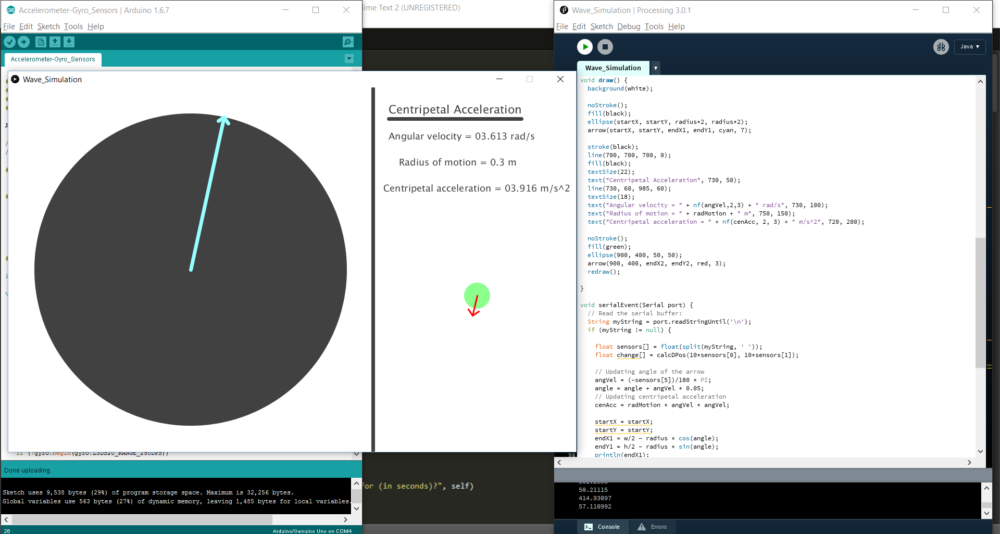
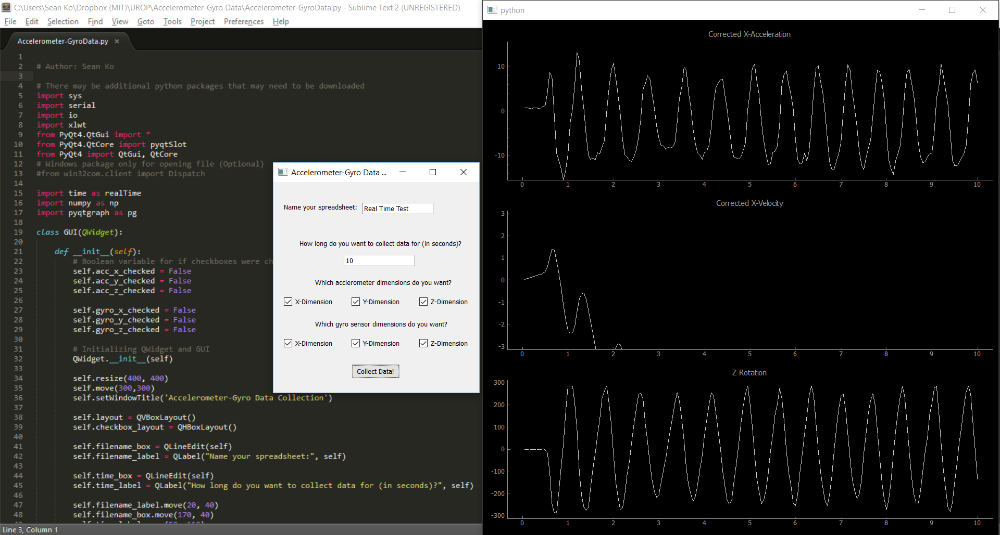

# Arduino Wave Simulation
  

###This package contains:
- [Python script](Accelerometer-GyroData.py) that displays a real-time graph of the X-acceleration, X-velocity, and Z-rotation due to the way I wired the accelerometer and gyroscope
- [Arduino sketch](Accelerometer-Gyroscope-Sketch/Accelerometer-Gyroscope-Sketch.ino) that outputs the X-, Y-, Z-accelerations and X-, Y-, Z-rotations in that order, each separated by a space
- [Processing sketch](Wave_Simulation/Wave_Simulation.pde) that displays a real-time simulation of the waving of the Arduino (Currently being worked on)

###Materials:
- Arduino Uno
- Acceleromter ([Adafruit MMA8451](https://learn.adafruit.com/adafruit-mma8451-accelerometer-breakout/overview) used here)
- Gyroscope ([Adafruit L3GD20H](https://www.adafruit.com/products/1032) used here)
- Breadboard (small would be ideal and easier to wave)

###Setup:
#####Accelerometer (MMA8451) --> Uno:
Vin --> 5V  
GND --> GND  
SCL --> A5  
SDA --> A4  

#####Gyroscope (L3GD20H) --> Uno:
Vin --> 5V  
GND --> GND  
 CS --> Digital 4  
SA0 --> Digital 5  
SDA --> Digital 6  
SCL --> Digital 7  
